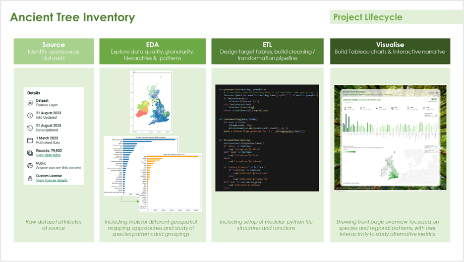
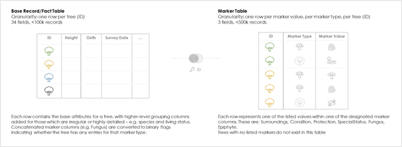
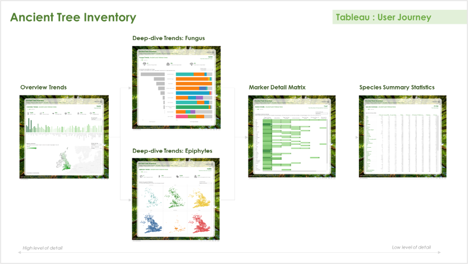

# ancient-trees
Welcome to this repository for analysis of the Ancient Tree Inventory! The inventory is a citizen science project owned and managed by the Woodland Trust, with the intention of collecting information on ancient, veteran and important trees across the UK and Republic of Ireland.Data reproduced with the permission of The Woodland Trust, accessed 09/2023.

All analysis within this repository has been performed on a personal interest basis to showcase a data design, transformation and visualisation skillset. [Explore the final dashboard on Tableau Public here!](https://public.tableau.com/app/profile/helen.k8608/viz/AncientTrees_16956587016370/AncientTreeInventory)

The full project lifecycle and outcome insights are detailed further in the [project overview document](./docs/ProjectSummary.pdf)



## Environment
For the purposes of this project, a virtual environment has been used with Python 3.11.5. The list of all packages installed within this environment is available in requirements.txt, and this is conducive to running the python and ipython notebooks stored in this repo.

## Target Table Design / Construction
The processing pipeline is available in the src folder, and is split across three files: config.json (storing variables such as document locations), functions.py (storing modular functions used in the data prep) and ancientTreeDataPrep.py (the main data prep process).
The data prep pipeline takes the following datasets as input:
- a raw copy of the [ancient tree inventory](https://opendata-woodlandtrust.hub.arcgis.com/datasets/)
- either of:
    - three shapefiles, covering the [Isle of Man](https://maps.princeton.edu/catalog/stanford-nk743nh6214), [Guernsey](https://maps.princeton.edu/catalog/stanford-bk868xv4713) and all designated [NUTs regions across Europe](https://ec.europa.eu/eurostat/web/gisco/geodata/reference-data/administrative-units-statistical-units/nuts)
    - a compiled shapefile covering the relevant NUTs regions for this analysis (UK & RoI) and the Isle of Man and Guernsey. This file is generated upon first run of the pipeline file if it doesn't already exist (note - it is available in the repo)

The output of the data prep pipeline is two tables - the Base table (one record per tree) and the Marker table (one record per marker value, per marker type, per tree). The former is identical granularity to the raw ATI data, whilst the latter is a pivotted view (e.g. 'long') of the markers which are concatenated in the original dataset. An example of this is a tree with multiple awards listed in the SpecialStatus column - this will be outputted as two rows, one per award, for the given tree.



This data model format ensures that text-heavy marker data can be stored separately and only referenced when required in visualisations. Both Power BI and Tableau use data which is 'related' but in separate tables in this manner, allowing for efficiency in visualisation calculations. Having fewer columns but more rows also allows for efficient storage. Outputs are stored in data/output

To run the pipeline, ensure a python environment is available (in this example, .venv) and has the requirements.txt list of modules installed. Then use the following command (windows cmd) 
```
.venv\Scripts\activate
python AncientTrees/src/ancientTreeDataPrep.py
```

See the [Data ReadMe](./data/README.md) for further info on how this folder is arranged and the ETL / archival process.

## Visualisation
The output Tableau dashboard is available on [Tableau Public here](https://public.tableau.com/app/profile/helen.k8608/viz/AncientTrees_16956587016370/AncientTreeInventory)

All sections are designed to be highly interactive, and the user is able to toggle between Ancient-only vs Ancient & Veteran trees throughout. It includes 5 dashboards moving from high to lower-level detail:
1) Overview and Geospatial : Species summaries (Count, Height, Girth), Headline KPIs, and regional / point-location mapping analysis.
2) Fungus Trends : A range of analysis including the distribution across tree species per fungus species, the propensity of each tree species to have fungus associated, correlation of fungus with tree specimen height/growth, regional distribution per fungus species, and co-occurrence of different fungus species on the same tree.
3) Epiphyte Trends : Equivalent analysis as in Fungus Trends, studying different types of epiphytes associated with tree records.
4) Marker Detail: Given a user-selected marker (e.g. Protection), generates a matrix showing distribution of each possible marker value across each tree species.
5) Species Summary : summary statistics for each tree species, including physical characteristics (height/girth) and marker details (e.g. % Protected)



Dashboard navigation is achieved using the page navigation menu which is activated from the top right-hand corner of each dashboard: 


